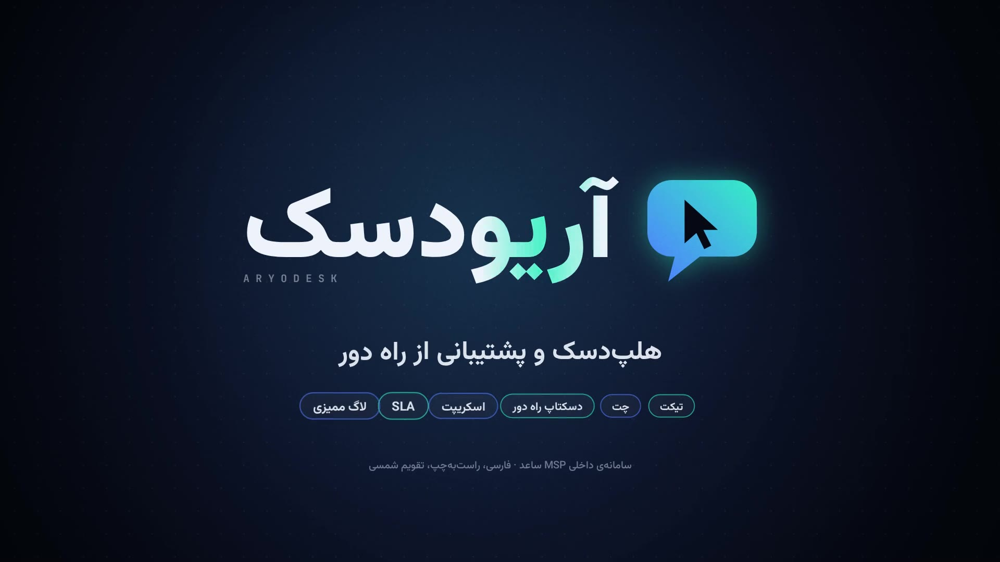

# آریودسک — موشن‌گرافیک ۱۵ ثانیه‌ای

یک فیلم محصول ۱۵ ثانیه‌ای، ۱۹۲۰×۱۰۸۰ و ۶۰ فریم بر ثانیه، که تمامش با کد ساخته شده است. نه کی‌فریمی دارد، نه تایم‌لاینی و نه صدای آماده‌ای. همه‌چیز فارسی و راست‌به‌چپ است و تاریخ‌ها شمسی‌اند.

**تماشا:** [`aryodesk.mp4`](aryodesk.mp4) (۱۵ ثانیه · 1080p60 · صدای استریو AAC)



## داستان

فیلم مسیر یک تیکت را از اول تا آخر دنبال می‌کند. تمپو ۱۲۸ BPM است: ۸ میزان ۴/۴ که دقیقاً ۱۵ ثانیه می‌شود. هر برش و هر پاپ روی ضرب می‌نشیند.

| میزان | زمان | صحنه | چه نشان می‌دهد |
|---|---|---|---|
| ۰۱ | 0.00 | برنامه‌ی کنار ساعت | تسک‌بار ویندوزِ راست‌به‌چپ (ساعت سمت چپ). آیکون آریودسک با فنر ظاهر می‌شود، نشانگر روی آن کلیک می‌کند و پنل از دل همان آیکون باز می‌شود |
| ۰۲ | 1.88 | ثبت تیکت | تایپ «پرینتر وصل نمی‌شود»، انتخاب اولویت «فوری» و ارسال. بعد تیک موفقیت، کارت «تیکت #۱۰۴۲» با SLA، و دنباله‌ای که تیکت را برای کارشناس می‌برد |
| ۰۳ | 3.75 | چت زنده | پنل به پنجره‌ی چت تغییر شکل می‌دهد: پیام‌ها، نشانگر «در حال نوشتن…» و درخواست رضایت برای اتصال از راه دور |
| ۰۴ | 5.63 | ایجنت Go | دوربین از پنل عقب می‌کشد و پنل یکی از گره‌های شبکه می‌شود. هر ایجنت فقط به سرور وصل می‌شود؛ بسته‌ها فقط رو به بیرون حرکت می‌کنند. یک اتصال ورودی به سپر می‌خورد (۰ پورت باز). بعد گزارش سخت‌افزار و نرم‌افزار و موج به‌روزرسانی امضاشده |
| ۰۵ | 7.50 | کنترل از راه دور | زوم به داخل صفحه‌ی PC-ACC-07 و عقب‌کشیدن تا کنسول کارشناس دیده شود. دسکتاپ راه دور، ترمینال PowerShell و انتقال فایل روی ضرب عوض می‌شوند و در آخر مُهر «تیکت حل شد» می‌خورد |
| ۰۶ | 9.38 | چندمشتری و SLA | ویپ‌پن راست‌به‌چپ. کارشناس فقط مشتری‌های مجاز خودش را می‌بیند و بقیه روی شانزدهم‌نت‌ها قفل می‌شوند. شمارش معکوس SLA، هشدار و «پاسخ داده شد» |
| ۰۷ | 11.25 | لاگ ممیزی | رویدادهای همین فیلم روی چنگ‌ها وارد لاگ می‌شوند، با زمان شمسی و زنجیره‌ی هش. یک تلاش برای ویرایش رد می‌شود و مُهر «غیرقابل‌تغییر» می‌خورد |
| ۰۸ | 13.13 | هویت | دراپ: نشان آریودسک (صفحه‌ای که حباب گفت‌وگو هم هست، با نشانگر ریموت در دلش) شکل می‌گیرد و واژه‌نشان از راست به چپ ظاهر می‌شود |

## چطور ساخته شده

- `reel.js`: کل فیلم یک تابع خالص `render(t)` است. هیچ فریمی به فریم قبلی وابسته نیست، پس رندر روی چند مرورگر پخش می‌شود. هر فریم ۸ بار در یک شاتر ۱۸۰ درجه کشیده می‌شود تا موشن‌بلور واقعی بدهد. جلوه‌های پس‌پردازش: ابیراهی رنگی و فلش روی ضرب‌ها، لرزش دوربین، گرین فیلم و وینیت.
- متن فارسی با شکل‌دهی واقعی Chromium (HarfBuzz) کشیده می‌شود. انیمیشن‌ها کلمه‌به‌کلمه‌اند، نه حرف‌به‌حرف، تا اتصال حروف فارسی نشکند. نیم‌فاصله‌ها (`‌`) درست‌اند و ارقام فارسی از تابع `fa()` می‌آیند.
- `synth.mjs`: موسیقی نمونه‌به‌نمونه سنتز می‌شود (کیک، کلپ، هت، بیس سایدچین‌شده، پد، آرپ، رایزر، ووش، گلیچ و ریورب). هر صدا در زمانی قرار می‌گیرد که از خود تصویر گرفته شده: تایپ، پاپ پیام‌ها، کلیک‌ها، قفل‌ها و ردیف‌های لاگ.
- `render.mjs`: Chromium بدون رابط را با ۴ ورکر اجرا می‌کند و فریم‌های PNG را به ffmpeg می‌فرستد.
- `index.html`: پیش‌نمایش بلادرنگ. پوشه را سرو کنید و صفحه را باز کنید؛ با کلیک پخش می‌شود و با کلیدهای جهت فریم‌به‌فریم جلو و عقب می‌روید.

```sh
cd aryodesk
node synth.mjs                       # -> build/aryodesk.wav
node render.mjs                      # -> aryodesk.mp4
node render.mjs --master             # نسخه‌ی تقریباً بی‌اتلاف
node render.mjs --stills 3.2,9.8     # فریم‌های تکی -> build/stills/
node render.mjs --sheet              # کانتکت‌شیت -> build/sheet.png
```

پیش‌نیازها: Node 18 به بالا، Playwright با Chromium، و ffmpeg با libx264. اگر `ffmpeg` در PATH نباشد، رندرر از `imageio-ffmpeg` استفاده می‌کند (`pip install imageio-ffmpeg`). مسیر ffmpeg را با متغیر `FFMPEG` هم می‌شود داد.

فونت‌ها: Vazirmatn و JetBrains Mono، هر دو با مجوز SIL Open Font License (پوشه‌ی `fonts/` را ببینید).

نام‌ها، دستگاه‌ها و هش‌های داخل فیلم نمایشی‌اند.
