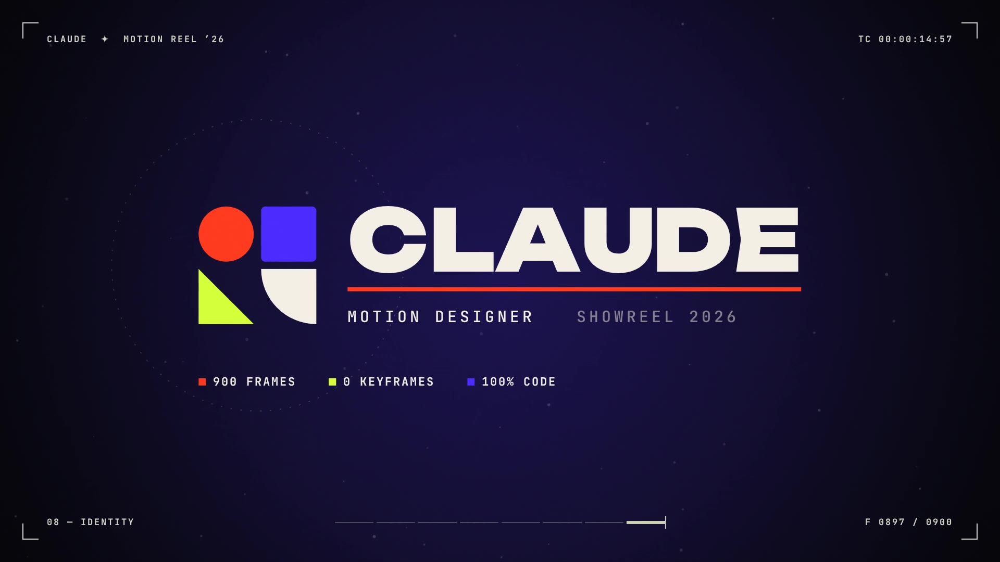

# Motion Reel ’26

A 15-second, 1080p60 motion design showreel made entirely in code: no keyframes, no timeline, no samples.



**Watch:** [`showreel.mp4`](showreel.mp4) (15.0 s · 1920×1080 · 60 fps · AAC stereo)

## The cut

128 BPM, 8 bars of 4/4 = exactly 15 s. One discipline per bar, every cut on the beat.

| Bar | Time | Scene | What it shows |
|---|---|---|---|
| 01 | 0.00 | Principles | Bouncing ball: squash & stretch, arcs, onion skin, anticipation, then a circle wipe |
| 02 | 1.88 | Kinetic type | `MOTION` slams in, then four words that move the way they read: EASE, SNAP, BOUNCE, FLOW |
| 03 | 3.75 | Geometry | Polygon morphs on the beat, echo outlines, radial bar systems, depth-sorted orbiters |
| 04 | 5.63 | 3D / particles | 1,600 particles: a burst into a sphere, a morph into a torus knot, then a fly-through into white |
| 05 | 7.50 | Craft | A graph editor: the bezier curve drives the square, onion skins and a spacing chart show the ease. The pitch of the playhead follows the curve |
| 06 | 9.38 | Simulation | Whip pan into metaballs computed as a scalar field, with the type knocked out of the liquid |
| 07 | 11.25 | Rhythm / edit | Cuts on eighth notes with slice glitches and RGB split, then a sixteenth-note strobe |
| 08 | 13.13 | Identity | The drop: a modular mark springs together and the name resolves |

## How it's made

- `reel.js`: the whole film as a pure function `render(t)`. Because no frame depends on the one before it, the renderer can run frames in parallel and draw each one 8× inside a 180° shutter to get true motion blur. Post effects: chromatic aberration, film grain, vignette, camera shake and an auto-contrast HUD.
- `synth.mjs`: the soundtrack, synthesized sample by sample (kick, clap, hats, sidechained bass, pads, arps, risers, whooshes, glitches, a Schroeder reverb). Every hit is placed at a time taken from the picture.
- `render.mjs`: drives headless Chromium across 4 workers and pipes PNG frames into ffmpeg.
- `index.html`: a real-time preview. Serve the folder and open it. Click to play; the arrow keys scrub.

```sh
cd showreel
node synth.mjs                 # -> build/reel.wav
node render.mjs                # -> showreel.mp4 (~2 min on 4 cores)
node render.mjs --master       # near-lossless, grain-preserving master
node render.mjs --stills 3.2,9.8   # single frames -> build/stills/
node render.mjs --sheet        # contact sheet -> build/sheet.png
```

It needs Node 18+, Playwright with Chromium, and an ffmpeg build that includes libx264. If `ffmpeg` isn't on your PATH, the renderer falls back to `imageio-ffmpeg`.

Fonts: Unbounded, Inter Tight and JetBrains Mono (SIL Open Font License, see `fonts/`).
